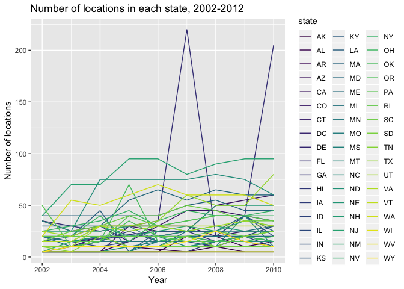
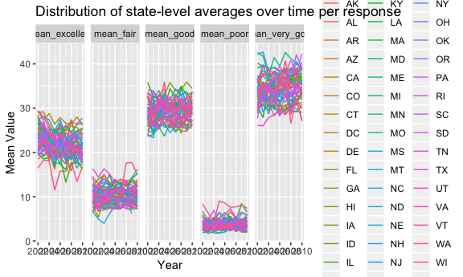
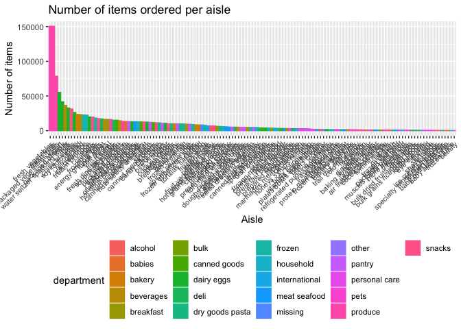

Homework \#3
================
Ashley Kang
10/10/2018

Problem 1
---------

This problem uses the BRFSS data. First, do some data cleaning:

-   Format the data to use appropriate variable names;
-   Focus on the “Overall Health” topic
-   Include only responses from “Excellent” to “Poor”
-   Organize responses as a factor taking levels ordered from “Excellent” to “Poor”

``` r
library(p8105.datasets)

brfss_data = brfss_smart2010 %>% 
  janitor::clean_names() %>% 
  rename(state = locationabbr, county = locationdesc) %>% 
  filter(topic == "Overall Health") %>% 
  mutate(response = forcats::fct_relevel(response, c("Excellent", "Very good", "Good", "Fair", "Poor"))) 
```

##### In 2002, which states were observed at 7 locations?

``` r
brfss_data_2002 = brfss_data %>%
  filter(year == "2002") %>%
  group_by(state) %>% 
  summarize(n_locations = n_distinct(county)) %>% 
  filter(n_locations == "7")
```

##### Make a “spaghetti plot” that shows the number of locations in each state from 2002 to 2010.

``` r
brfss_data %>% 
  group_by(state, year) %>% 
  summarize(n_locations = n()) %>% 
  ggplot(aes(x = year, y = n_locations, color = state)) +
  labs(
    title = "Number of locations in each state from 2002-2012",
    x = "Year",
    y = "Number of locations") +
  geom_line() +
  viridis::scale_color_viridis(discrete = TRUE) +
  theme(legend.position = "right")
```



##### Make a table showing, for the years 2002, 2006, and 2010, the mean and standard deviation of the proportion of “Excellent” responses across locations in NY State.

``` r
brfss_data %>% 
  filter(year == 2002 | year == 2006 | year == 2010, state == "NY") %>% 
  spread(key = response, value = data_value) %>% 
  janitor::clean_names() %>% 
  group_by(state, year) %>% 
  summarize(mean_excellent = mean(excellent, na.rm = TRUE),
            sd_excellent = sd(excellent, na.rm = TRUE)) %>% 
  knitr::kable()
```

| state |  year|  mean\_excellent|  sd\_excellent|
|:------|-----:|----------------:|--------------:|
| NY    |  2002|         24.04000|       4.486424|
| NY    |  2006|         22.53333|       4.000833|
| NY    |  2010|         22.70000|       3.567212|

##### For each year and state, compute the average proportion in each response category (taking the average across locations in a state). Make a five-panel plot that shows, for each response category separately, the distribution of these state-level averages over time.

``` r
brfss_data %>% 
  spread(key = response, value = data_value) %>% 
  janitor::clean_names() %>% 
  group_by(state, year) %>% 
  summarize(mean_excellent = mean(excellent, na.rm = TRUE),
            mean_very_good = mean(very_good, na.rm = TRUE),
            mean_good = mean(good, na.rm = TRUE),
            mean_fair = mean(fair, na.rm = TRUE),
            mean_poor = mean(poor, na.rm = TRUE)) %>% 
  gather(key = mean_variable, value = mean_value, mean_excellent:mean_poor) %>% 
  ggplot(aes(x = year, y = mean_value, color = state)) +
  labs(
    title = "Distribution of state-level averages over time per response",
    x = "Year",
    y = "Mean Value") +
  geom_line() +
  facet_grid(~mean_variable)  
```



Problem 2
---------

This problem uses the Instacart data.

##### Loading and cleaning Instacart data

``` r
instacart_data = instacart %>% 
  janitor::clean_names()
```

##### How many aisles are there, and which aisles are the most items ordered from?

``` r
number_aisles = 
  instacart_data %>% 
  distinct(aisle_id) %>% 
  nrow()

instacart_data %>%
  group_by(aisle) %>%
  summarize(number_per_aisle = n()) %>%
  arrange(desc(number_per_aisle)) %>%
  head() %>%
  knitr::kable()
```

| aisle                         |  number\_per\_aisle|
|:------------------------------|-------------------:|
| fresh vegetables              |              150609|
| fresh fruits                  |              150473|
| packaged vegetables fruits    |               78493|
| yogurt                        |               55240|
| packaged cheese               |               41699|
| water seltzer sparkling water |               36617|

##### Make a plot that shows the number of items ordered in each aisle. Order aisles sensibly, and organize your plot so others can read it.

``` r
instacart_data %>%
  group_by(aisle, department) %>%
  summarize(number_per_aisle = n()) %>%
  ggplot(aes(x = aisle, y = number_per_aisle, color = department)) + 
  labs(
    title = "Number of items ordered per aisle",
    x = "Aisle",
    y = "Number per aisle") +
  geom_point() +
  facet_grid(~department)
```



##### Make a table showing the most popular item aisles “baking ingredients”, “dog food care”, and “packaged vegetables fruits”

``` r
instacart_data %>% 
  filter(aisle == "baking ingredients" | aisle == "dog food care" | aisle == "packaged vegetables fruits") %>% 
  group_by(aisle, product_name) %>% 
  summarize(number_per_aisle = n()) %>% 
  top_n(1, number_per_aisle) %>% 
  arrange(desc(number_per_aisle)) %>% 
  knitr::kable()
```

| aisle                      | product\_name                                 |  number\_per\_aisle|
|:---------------------------|:----------------------------------------------|-------------------:|
| packaged vegetables fruits | Organic Baby Spinach                          |                9784|
| baking ingredients         | Light Brown Sugar                             |                 499|
| dog food care              | Snack Sticks Chicken & Rice Recipe Dog Treats |                  30|

##### Make a table showing the mean hour of the day at which Pink Lady Apples and Coffee Ice Cream are ordered on each day of the week; format this table for human readers (i.e. produce a 2 x 7 table).

``` r
instacart_data %>% 
  filter(product_name == "Pink Lady Apples" | product_name == "Coffee Ice Cream") %>% 
  select(product_name, order_dow, order_hour_of_day) %>% 
  group_by(product_name, order_dow) %>% 
  summarize(mean_order_hour = mean(order_hour_of_day)) %>% 
  spread(key = order_dow, value = mean_order_hour) %>% 
  knitr::kable()
```

| product\_name    |         0|         1|         2|         3|         4|         5|         6|
|:-----------------|---------:|---------:|---------:|---------:|---------:|---------:|---------:|
| Coffee Ice Cream |  13.77419|  14.31579|  15.38095|  15.31818|  15.21739|  12.26316|  13.83333|
| Pink Lady Apples |  13.44118|  11.36000|  11.70213|  14.25000|  11.55172|  12.78431|  11.93750|

Problem 3
---------

This problem uses the NY NOAA data.

``` r
ny_noaa_data = ny_noaa %>% 
  janitor::clean_names()
```
