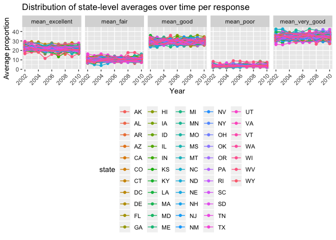

Homework \#3
================
Ashley Kang
10/10/2018

Problem 1
---------

This problem uses the BRFSS data. First, do some data cleaning:

-   Format the data to use appropriate variable names;
-   Focus on the “Overall Health” topic
-   Include only responses from “Excellent” to “Poor”
-   Organize responses as a factor taking levels ordered from “Excellent” to “Poor”

``` r
library(p8105.datasets)
data(brfss_smart2010)

brfss_data = brfss_smart2010 %>% 
  janitor::clean_names() %>% 
  rename(state = locationabbr, county = locationdesc) %>% 
  filter(topic == "Overall Health") %>% 
  mutate(response = forcats::fct_relevel(response, c("Excellent", "Very good", "Good", "Fair", "Poor"))) 
```

##### In 2002, which states were observed at 7 locations?

``` r
brfss_data_2002 = brfss_data %>%
  filter(year == "2002") %>%
  group_by(state) %>% 
  summarize(number_locations = n_distinct(county)) %>% 
  filter(number_locations == "7")
```

There are 3 states that were observed at 7 locations in 2002: Connecticut (CT), Florida (FL), and North Carolina (NC).

##### Make a “spaghetti plot” that shows the number of locations in each state from 2002 to 2010.

``` r
brfss_data %>% 
  group_by(year, state) %>% 
  summarize(number_locations = n()) %>% 
  ggplot(aes(x = year, y = number_locations, color = state)) +
  labs(
    title = "Number of locations in each state, 2002-2012",
    x = "Year",
    y = "Number of locations") +
  geom_line() +
  theme(legend.position = "right") +
  viridis::scale_color_viridis(name = "state", discrete = TRUE)
```


##### Make a table showing, for the years 2002, 2006, and 2010, the mean and standard deviation of the proportion of “Excellent” responses across locations in NY State.

``` r
brfss_data %>% 
  filter(year == 2002 | year == 2006 | year == 2010, state == "NY") %>% 
  spread(key = response, value = data_value) %>% 
  janitor::clean_names() %>% 
  group_by(state, year) %>% 
  summarize(mean_excellent = mean(excellent, na.rm = TRUE),
            sd_excellent = sd(excellent, na.rm = TRUE)) %>% 
  knitr::kable()
```

| state |  year|  mean\_excellent|  sd\_excellent|
|:------|-----:|----------------:|--------------:|
| NY    |  2002|         24.04000|       4.486424|
| NY    |  2006|         22.53333|       4.000833|
| NY    |  2010|         22.70000|       3.567212|

##### For each year and state, compute the average proportion in each response category (taking the average across locations in a state). Make a five-panel plot that shows, for each response category separately, the distribution of these state-level averages over time.

``` r
brfss_data %>% 
  spread(key = response, value = data_value) %>% 
  janitor::clean_names() %>% 
  group_by(state, year) %>% 
  summarize(mean_excellent = mean(excellent, na.rm = TRUE),
            mean_very_good = mean(very_good, na.rm = TRUE),
            mean_good = mean(good, na.rm = TRUE),
            mean_fair = mean(fair, na.rm = TRUE),
            mean_poor = mean(poor, na.rm = TRUE)) %>% 
  gather(key = mean_variable, value = mean_value, mean_excellent:mean_poor) %>% 
  ggplot(aes(x = year, y = mean_value, color = state)) +
  labs(
    title = "Distribution of state-level averages over time per response",
    x = "Year",
    y = "Average proportion") +
  geom_point() +
  geom_line() +
  facet_grid(~mean_variable) + 
  theme(axis.text.x = element_text(angle = 45, hjust = 1)) +
  theme(legend.position = "bottom")
```



Problem 2
---------

This problem uses the Instacart data.

##### Loading and cleaning Instacart data

``` r
instacart_data = instacart %>% 
  janitor::clean_names()

head(instacart_data)
```

    ## # A tibble: 6 x 15
    ##   order_id product_id add_to_cart_ord… reordered user_id eval_set
    ##      <int>      <int>            <int>     <int>   <int> <chr>   
    ## 1        1      49302                1         1  112108 train   
    ## 2        1      11109                2         1  112108 train   
    ## 3        1      10246                3         0  112108 train   
    ## 4        1      49683                4         0  112108 train   
    ## 5        1      43633                5         1  112108 train   
    ## 6        1      13176                6         0  112108 train   
    ## # ... with 9 more variables: order_number <int>, order_dow <int>,
    ## #   order_hour_of_day <int>, days_since_prior_order <int>,
    ## #   product_name <chr>, aisle_id <int>, department_id <int>, aisle <chr>,
    ## #   department <chr>

``` r
tail(instacart_data)
```

    ## # A tibble: 6 x 15
    ##   order_id product_id add_to_cart_ord… reordered user_id eval_set
    ##      <int>      <int>            <int>     <int>   <int> <chr>   
    ## 1  3421063      13565                2         1  169679 train   
    ## 2  3421063      14233                3         1  169679 train   
    ## 3  3421063      35548                4         1  169679 train   
    ## 4  3421070      35951                1         1  139822 train   
    ## 5  3421070      16953                2         1  139822 train   
    ## 6  3421070       4724                3         1  139822 train   
    ## # ... with 9 more variables: order_number <int>, order_dow <int>,
    ## #   order_hour_of_day <int>, days_since_prior_order <int>,
    ## #   product_name <chr>, aisle_id <int>, department_id <int>, aisle <chr>,
    ## #   department <chr>

The dataset `instacart` consists of **1384617 rows** and **15** columns. Each row is a single product from an order and corresponds to information on the `product_name`, `grocery aisle`, `department`, if the product was `reordered`, day of the week and hour the product was ordered (`order_hour_of_day`), and the `user_id` who ordered it. There are **131209 distinct users** who ordered **39123 products** from **21 distinct departments**.

##### How many aisles are there, and which aisles are the most items ordered from?

``` r
number_aisles = 
  instacart_data %>% 
  distinct(aisle_id) %>% 
  nrow()

instacart_data %>%
  group_by(aisle) %>%
  summarize(number_per_aisle = n()) %>%
  arrange(desc(number_per_aisle)) %>%
  head() %>%
  knitr::kable()
```

| aisle                         |  number\_per\_aisle|
|:------------------------------|-------------------:|
| fresh vegetables              |              150609|
| fresh fruits                  |              150473|
| packaged vegetables fruits    |               78493|
| yogurt                        |               55240|
| packaged cheese               |               41699|
| water seltzer sparkling water |               36617|

There are 134 distinct aisles, of which the top 6 aisles with the most items ordered from are:

-   Fresh vegetables - 150,609 items ordered
-   Fresh fruits - 150,473 items ordered
-   Packaged vegetables fruits - 78,493 items ordered
-   Yogurt - 55,240 items ordred
-   Packaged cheese - 41,699 items ordered
-   Water seltzer sparkling water - 36,617 items ordered

##### Make a plot that shows the number of items ordered in each aisle. Order aisles sensibly, and organize your plot so others can read it.

``` r
instacart_data %>%
  group_by(aisle, department) %>%
  summarize(number_per_aisle = n()) %>%
  ungroup() %>%
  mutate(aisle = reorder(aisle, desc(number_per_aisle))) %>% 
  ggplot(aes(x = aisle, y = number_per_aisle, color = department, fill = department)) + 
  labs(
    title = "Number of items ordered per aisle",
    x = "Aisle",
    y = "Number of items") +
  geom_col() +
  theme(axis.text.x = element_text(angle = 45, hjust = 1, size = 8),
        legend.position = "bottom")
```


##### Make a table showing the most popular item aisles “baking ingredients”, “dog food care”, and “packaged vegetables fruits”

``` r
instacart_data %>% 
  filter(aisle == "Baking Ingredients" | aisle == "Dog Food Care" | aisle == "Packaged Vegetables Fruits") %>% 
  group_by(aisle, product_name) %>% 
  summarize(number_per_aisle = n()) %>% 
  top_n(1, number_per_aisle) %>% 
  arrange(desc(number_per_aisle)) %>% 
  knitr::kable()
```

aisle product\_name number\_per\_aisle ------ ------------- -----------------

##### Make a table showing the mean hour of the day at which Pink Lady Apples and Coffee Ice Cream are ordered on each day of the week; format this table for human readers (i.e. produce a 2 x 7 table).

``` r
instacart_data %>% 
  filter(product_name == "Pink Lady Apples" | product_name == "Coffee Ice Cream") %>% 
  select(product_name, order_dow, order_hour_of_day) %>% 
  group_by(product_name, order_dow) %>% 
  summarize(mean_order_hour = mean(order_hour_of_day)) %>% 
  spread(key = order_dow, value = mean_order_hour) %>% 
  setNames(c("Product", "Sunday", "Monday", "Tuesday", "Wednesday", "Thursday", "Friday", "Saturday")) %>%
  knitr::kable()
```

| Product          |    Sunday|    Monday|   Tuesday|  Wednesday|  Thursday|    Friday|  Saturday|
|:-----------------|---------:|---------:|---------:|----------:|---------:|---------:|---------:|
| Coffee Ice Cream |  13.77419|  14.31579|  15.38095|   15.31818|  15.21739|  12.26316|  13.83333|
| Pink Lady Apples |  13.44118|  11.36000|  11.70213|   14.25000|  11.55172|  12.78431|  11.93750|

Problem 3
---------

This problem uses the NY NOAA data.

``` r
data(ny_noaa)

ny_noaa_data = ny_noaa %>% 
  janitor::clean_names()

head(ny_noaa_data)
```

    ## # A tibble: 6 x 7
    ##   id          date        prcp  snow  snwd tmax  tmin 
    ##   <chr>       <date>     <int> <int> <int> <chr> <chr>
    ## 1 US1NYAB0001 2007-11-01    NA    NA    NA <NA>  <NA> 
    ## 2 US1NYAB0001 2007-11-02    NA    NA    NA <NA>  <NA> 
    ## 3 US1NYAB0001 2007-11-03    NA    NA    NA <NA>  <NA> 
    ## 4 US1NYAB0001 2007-11-04    NA    NA    NA <NA>  <NA> 
    ## 5 US1NYAB0001 2007-11-05    NA    NA    NA <NA>  <NA> 
    ## 6 US1NYAB0001 2007-11-06    NA    NA    NA <NA>  <NA>

``` r
tail(ny_noaa_data)
```

    ## # A tibble: 6 x 7
    ##   id          date        prcp  snow  snwd tmax  tmin 
    ##   <chr>       <date>     <int> <int> <int> <chr> <chr>
    ## 1 USW00094794 2007-01-26    NA    NA    NA <NA>  <NA> 
    ## 2 USW00094794 2007-01-27    NA    NA    NA <NA>  <NA> 
    ## 3 USW00094794 2007-01-28    NA    NA    NA <NA>  <NA> 
    ## 4 USW00094794 2007-01-29    NA    NA    NA <NA>  <NA> 
    ## 5 USW00094794 2007-01-30    NA    NA    NA <NA>  <NA> 
    ## 6 USW00094794 2007-01-31    NA    NA    NA <NA>  <NA>

``` r
# Missing
missing_precip = ny_noaa_data %>%
  filter(is.na(prcp))

missing_snow = ny_noaa_data %>%
  filter(is.na(snow))

missing_snow_depth = ny_noaa_data %>%
  filter(is.na(snwd))

missing_tmax = ny_noaa_data %>%
  filter(is.na(tmax))

missing_tmin = ny_noaa_data %>%
  filter(is.na(tmin))

# Precipitation
avg_precip = mean(ny_noaa_data$prcp, na.rm = TRUE)

# Snowfall
avg_snow = mean(ny_noaa_data$snow, na.rm = TRUE)

# Snow-depth
avg_snow_depth = mean(ny_noaa$snwd, na.rm = TRUE)
```

The dataset `ny_noaa` contains **2595176 rows** and **7 columns**. Each row corresponds to a weather station's report from the corresponding date. The average amount of precipitation is **29.8232355 tenths of mm**. The average amount of snowfall is **4.987025 mm**. The average snow depth is **37.3122807 mm**. Missing data, particularly for variables `snwd`, `tmax`, and `tmin` is an issue in this dataset, as the proportion of missing `prcp` data is **5.6195803%**, missing `snow` data is **14.689601%**, missing snow-depth data is **22.8033089%**, missing `tmax` data is **43.7102532%**, and missing `tmin` data is **43.7126422%**.
